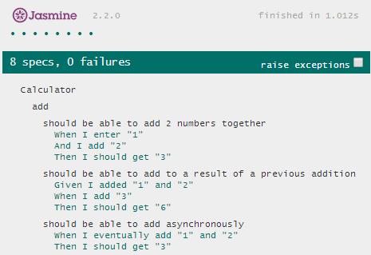

browsered-jasmine-cucumber
================

Форк, которы дорабатываеться для исользование в браузере:
* Ориентирован на использование require.js
* Немного изменён синтаксис спецификаций - что-бы стандартные срдества форматирования редактора (WebStorm) выстраивали отступы правильно.
* Добавлена группировка фич, назначение сценарию фонов.
* У Gherkin утверждений можно задавть приоритеты, откуда их барть: по умолчанию из описания шагов фичи, фона, группы.
* Перестрины мапинг Gherkin утверждений - каждое в своём it jasmin-а. Given/When добавлен expect(true).toBeTruthy().

Убраны расширения контекста обработчика шага, которое позволяло вызывать другие шаги в себе.
 
В планах
* examples у сценариев - повторяет данный сценарий с параметрами из таблицы. В название сценария добавляет имя строки.
* улучшить группы - при поиске шагов фичи утитывать в какой она группе. 
* добавить уровень интеграционного тестирования, когда ключевым становиться сценарий, в котором могут учавствовать несколько функций и объектов.


# Motivation

## Мысль первая
В процессе разработки можно выделить и описать набор сценариев (использования готового продукта). В сценариях можно выделить отдельный/обособленные функции/функционал и объекты, которые в них участвуют. При этом предпологаеться что один и тот-же объект может участвовать в нескольких сценариях и быть использован в нескольких функциях/фичах.

Соответственно есть пожелание/стремление описать:

* специфицировать отдельный объект, и "подёргать" его методы в виртуальном/управляемом/faked окружении. 
Для этого unit test есть.

* специфицировать отдельный функционал, который может быть использован в разных сценариях и задействовать
несколько объектов в себе. При этом для проверки правильности может понадобиться заглянуть внутрь используемых
объектов, зделать частичную эмуляцию окружения. Этакое тестирование в режиме белого ящика. Для этого функциональное тестирование, di-контейнеры (которые позволяют для теста подставить подделки/прокси_объекты).

* специфицировать сами сценарии поведения, которые в себе задействуют несколько функций. Этакое интеграционное
тестирование на частных сценариях использования.

Тут описание функции - по существу тоже сценарий/алгоритм, только направленный на достижение конкретной/одной цели.

Тут функция, сценарий, алгоритм - близкие по смыслу слова, частично перекрывающиеся...


## Мысль вторая
В коде могут быть описаны:

* объекты (структура и алгоритмы)

    * тут понятие алгоритма в более узком смысле - есть точка/состояние с которой он начинаеться, задан набор путей (последовательность действий в зависимости от исходных данных), и конечное состояние - в которое в нормальной ситуации он обязательно приведёт/переведёт объект.
    
    * т.е. на графе состояний алгоритм привязан к исходному состоянию и задаёт набор действий которые надо выполнить что-бы перейти к другому состоянию. При этом состояния всегда одни и те-же, а вот данные в них могут быть разными.
    
    * так-же сужение в смысле - алгоритм локализован в пределах объекта (и его частей) и направлен на преобразования состояния данного объекта (хоть в нём и могут быть действия, по уведомлению других объектов, о том что состояние меняеться).
 
 
* функции/фичи - имееться в виду те вещи, которые система умеет делать, обязанности на неё возложенные

    * их воспринимаю как понятие [целевой функции управления](#dotu2) из [достаточно общей теории управления (ДОТУ)][dotu]
 
    * имееться в виду - есть: набор исходных ситуаций/состояний и целевое состояния. Функция для каждого из исходных/промежуточных состояний говорит что надо делать что-бы достичь целевого. Как-бы проводит из любой точки к целевой точке. Либо задаёт сценарий по которому система перейдёт в целевое состояние - т.е. связывает набор объектов и задаёт им параметры/состояния так, что-бы система попала в целевое состояние на основе исполнения объектами своих алгоритмов. 
     
    * от алгоритма отличаеться тем что несколько начальных состояний, задаёт сценарий преобразования нескольких объектов, "прокладывает путь/проводит" через несколько состояний. При этом эти объекты не есть частями функции, они в ней участвуют, с ней связаны.


*  сценарии
    
    * тут идея в том, что в сценарий описывает как объекты взаимодействуют друг с другом (предпологая что одни и те-же объекты/функции по разному собранные/связанные вместе и настроенные будут вести к разным состояниям)
    
    * так-же сценарий может быть многовариантным и по ходу его исполнения меняться конечная цель - либо режим работы системы
    
    * функция тоже может содержать сценарий - как задание связей между объектами, которое приведёт к достижению цели. Однако сценарий может быть и более широким - установливать взаимосвязей между функциями - одна из причин выделить его отдельным понятием.
    
    * сценарий отличаеться от алгоритма, т.к. сфокусирован на устанавлении взаимосвязи между объектами, что-бы далее, объекты функционирую по своим алгоритмам, вели систему к цели. А алгоритм - сфокусирован на описании набора действий, которые надо выполнить (на переходе между состояниями).

## Мысль третья
Для описания каждого сценария (отдельного либо сценария функции, а так-же для описания алгоритма) удобно выделять свой язык. Т.е. для данного сценария, объекты предоставляют свои отдельные синтаксис и семантику. При этом согласования фраз разных сценариев (взаимного отображение смысла состояния объекта в фразы языков) ложиться на обязанности объекта (инкапсулированно в него).

## Заключение
Соответственно приведенным мыслям цель проэкта добавить возможность описания функций (с разными условиями их выполнения) и сценариев в виде Gherkin нотации (возможно несколько разширенной). Создать инструмент надстройку над jasmin. Описать инструмент и пример использования. Сформулировать концепцию разработки с такими мыслями и инструментом.


#API
I recommend splitting your files into specs and steps, here is an example specs.js file

```javascript
feature('add', 'Calculator')
    .add(scenario('should be able to add 2 numbers together')
        .when('I enter "1"')
        .and('I add "2"')
        .then('I should get "3"'))

    .add(scenario('should be able to add to a result of a previous addition')
        .given('I added "1" and "2"')
        .when('I add "3"')
        .then('I should get "6"'))

    .add(scenario('should be able to add asynchronously')
        .when('I eventually add "1" and "2"')
        .then('I should get "3"'));
```



```javascrip
    var ctx = {};

    featureSteps('add')
        .before(function (fCtx) {
            this.values = [];
            this.total = null;
        })
        .given('I added "(.*)" and "(.*)"', function (first, second) {
//            this.when('I enter "' + first + '"');
//            this.when('I add "' + second + '"');
            ctx.whenEnter.call(this, first);
            ctx.whenAdd.call(this, second);
        })
        .given('I eventually add "(.*)" and "(.*)"', function (first, second) {
            var done = this.async(),
                scenarioContext = this;

            setTimeout(function () {
                ctx.whenEnter.call(scenarioContext, first);
                ctx.whenAdd.call(scenarioContext, second);
//                scenarioContext.when('I enter "' + first + '"');
//                scenarioContext.when('I add "' + second + '"');
                done();
            }, 1000);
        })
        .when('I enter "(.*)"', ctx.whenEnter = function (val) {
            this.values.push(val * 1);
        })
        .when('I add "(.*)"', ctx.whenAdd = function(val) {
            this.values.push(val * 1);
            this.total = this.values[0] + this.values[1];
            this.values = [this.total];
        })
        .then('I should get "(.*)"', function (val) {
            expect(this.total).toBe(val * 1);
        });
```


So what are we doing?

```javascript
	feature('Calculator: add')
```

Creates a feature to run tests and serves 2 functions. 
1) the string is used in output for a failing test
2) when declaring step definition, we use regex against the feature string

```javascript
	.scenario('should be able to add 2 numbers together')
```

Creates a scenario, which really just provides output during a failing test

```javascript
	.when('I enter "1"')
```

Tells jasmine-cucumber to execute the step definition that matches `'I enter "1"'`

```javascript
	.and('I add "2"')
```

Is the same as `when('I add "2"')`. 

*Note:* Given and When are interchangable, thens are special because they are wrapped in a jasmine `it()`. In v2.0 they likely will all be interchangeable. 

Enough about the specs, lets take a look at the steps. 

```javascript
	featureSteps('Calculator:')
```

is using regex to say match all features with `Calculator:`

```javascript
	    .before(function(){
    	    this.values = [];
        	this.total = null;
	    })
```
	   
provides code to run before each assertion, this maps to a jasmine `beforeEach`. `this` is a `scenarioContext` which is reset on every assertion (`then`) and allows us to share state between step definitions

```javascript
	    .when('I enter "(.*)"', function(val){
    	    this.values.push(val * 1);
	    })
```
	    
matches `I enter "1"` making val = `'1'` 
	 
```javascript
    	.when('I add "(.*)"', function(val){
        	this.values.push(val * 1);
	        this.total = this.values[0] + this.values[1];
    	    this.values = [this.total];
	    })
```
	    
matches `I add "2"` 
	    
```javascript
    	.then('I should get "(.*)"', function(val){
        	expect(this.total).toBe(val * 1);
	    })
```

matches `I should get "3"` and does the assertion which is being wrapped in a jasmine `it()`
	    
```javascript
  	.given('I added "(.*)" and "(.*)"', function(first, second){
        	this.when('I enter "' + first + '"');
	        this.when('I add "' + second + '"');
    	})
```

Async is also supported with an api inspired by Grunt. 

```javascript
    	.when('I add "(.*)"', function(val){
        	var done = this.async(),
        	    scenarioContext = this;
        	setTimeout(function(){
        		scenarioContext.values.push(val * 1);
	        	scenarioContext.total = scenarioContext.values[0] + scenarioContext.values[1];
    	    	scenarioContext.values = [scenarioContext.total];
        		done();
        	});
	    })
```
The next step won't be called until the done function is executed. In effect, done calls the next step. 
    	
This step definition is especially cool as it allows us to abstract away other step definitions. This allows the more complex scenario to be more readable with one line instead of 2 (imagine 4 or 5 lines of setup for each scenario in a real world app). It then re-uses the existing steps by simply creating the strings that would match their regex. 

Last thing worth mentioning is the output… 

If you enter a string that doesn't match any regex, the scenario will fail stating that it is missing a step definition: 

	Feature: Calculator: add
    Scenario: should be able to add to a result of a previous addition
     Given  I added "1" and "2"
     When  I add "3"

    Missing step definitions FAILED
      Missing step definitions:
        I get "6"
        
So now we know we need a step definition for 'I get "6"', or do we… it also attempts to find steps that are a close match and will provide a hint in case it already exists… 

    Feature: Calculator: add
    Scenario: should be able to add to a result of a previous addition
     Given  I added "1" and "2"
     When  I add "3"

    Missing step definitions FAILED
      Missing step definitions:
        I get "6"
          Did you mean?
            I should get "3" (8)
            
It is using levenshteinDistance which is very rough, but often its just enough to remind you that you're off by one word or letter.

## Want More… 
Unlike traditional cucumber, you can pass plain javascript objects into your gherkin statements. 

```javascript
	.given('a person', { name : 'Lance', age : 3 })
```

Which is passed to your step definition

```javascript
	.given('a person', function(person){
    	this.person = person;
  	})
```
You can pass any object, even an array

```javascript
	.given('people', [
      { name : 'Lance', age : 3 },
      { name : 'Lana', age : 2 }
    ])
```

In my experience this has been most useful when passing in many properties through regex gets overly verbose, eg: 

```javascript
	.given('a person named "Lance"')
	.given('that person is "3" years old')
	.given('that person has "2" siblings')
```

Repeat this for 4 or 5 scenarios and you will really appreciate 

```javascript
	.given('a person', { name : 'Lance', age : 3, siblings : 2 })
	
```

Special thanks to gregorylimoratto for a pull request to improve the output of failed tests to include these arguments

Gotchas
===

Be careful not to use 'this' inside the inject function, as it will be a different context than your scenario. In this example, we are caching the scenario context at the top level, then using it to grab an $injector.

```javascript
.before(function(){
    var scenarioContext = this;

    module('i18n');
    inject(function(_$injector_){
         scenarioContext.$injector = _$injector_;
    });
        
    ...
})
```
# Example
As said previously, jasmine-cucumber won't make sense for every test you have. Where it excels is when the **intent** is getting *lost* in the complexity of the tests themselves. How will a new user (or you in a few months) know what the intent is of the test that is failing, or where to inject your new scneario or regression? With cucumber, this is easy, the intent is human readable and separated from the implementation. The architecture to manage the complexity is a series of step definitions. There isn't a lot to ramp up to. 

Take these 2 examples

## Before
```javascript
describe('i18n interpolation specs', function(){
    // NOTE: we are testing with $compile instead of $interpolate b/c $compile is upstream and gives us more confidence
    //  that we can interpolate attributes and other scenarios abstracted away from $interpolate
    var $compile,
        scope,
        getWatchCount,
        $interpolate;

    beforeEach(function(){
        module('i18n');
        inject(function(i18nMessageResolver, i18nMessages, _$compile_, $rootScope, _$interpolate_){
            $compile = _$compile_;
            scope = $rootScope.$new(true);
            scope.name = 'Lance';
            $interpolate = _$interpolate_;

            angular.extend(i18nMessages, {
                'greeting.label' : 'Hi',
                'greeting.dynamicLabel' : 'Hi {0}, so glad to see you again!',
                'greeting.moreDynamicLabel' : 'Hi {0}, you\'re {1} years old today!',
                'greeting.multiDynamicLabel' : 'Hi {0}, you are {0}, right?',
                'simple.choice' : '{0} {0,choice,0#cars|1#car|1<cars}',
                'decimal.choice' : '{0,choice,0#none|.5#half|1#one|1.5#one and a half|1.5<lots}',
                'negative.choice' : '{0,choice,-1#negative|0#zero|1#one|1<lots}',
                'dynamic.choice' : '{0,choice,0#no leads|1#1 lead|2#{0} leads}'
            });
            getWatchCount = function(){
                return $rootScope.$$watchers + scope.$$watchers;
            };

        });
    });

    // a series of scenarios
    // left side should be wrapped in any element - (easier to test by calling element.html() so we need any element)
    // right side should be the expected .html() of that element
    var expectations = {
        // nothing to interpolate
        "<p>Hi</p>" : "Hi",

          // a simple label
        "<p>{{@i18n(greeting.label)}}</p>" : "Hi",

        // two simple labels
        "<p>{{@i18n(greeting.label)}} {{@i18n(greeting.label)}}</p>" : "Hi Hi"
    };

    var expectationsWithWatch = {
        // interpolate without i18n
        "<p>{{name}}</p>" : "Lance",

        // a label that is partially dynamic
        "<p>{{@i18n(greeting.dynamicLabel)('Lance')}}</p>" : "Hi Lance, so glad to see you again!",

        // a label that is more dynamic
        "<p>{{@i18n(greeting.moreDynamicLabel)('Lance', 3)}}</p>" : "Hi Lance, you're 3 years old today!",

        // a label with multiple instances of a variable
        "<p>{{@i18n(greeting.multiDynamicLabel)('Lance')}}</p>" : "Hi Lance, you are Lance, right?",

        // a label with choice format (zero)
        "<p>{{@i18n(simple.choice)(0)}}</p>" : "0 cars",

        // a label with choice format (1)
        "<p>{{@i18n(simple.choice)(1)}}</p>" : "1 car",

        // a label with choice format (2)
        "<p>{{@i18n(simple.choice)(2)}}</p>" : "2 cars",

        // a label with choice format negative
        "<p>{{@i18n(negative.choice)(1)}}</p>" : "one",
        "<p>{{@i18n(negative.choice)(-1)}}</p>" : "negative",

        // a label with choice format decimal (.5)
        "<p>{{@i18n(decimal.choice)(.5)}}</p>" : "half",

        // a label with choice format decimal (1.5)
        "<p>{{@i18n(decimal.choice)(1.5)}}</p>" : "one and a half",

        // a label with choice format decimal (>1.5)
        "<p>{{@i18n(decimal.choice)(1.6)}}</p>" : "lots",

        // dynamic.choice
        "<p>{{@i18n(dynamic.choice)(0)}}</p>" : "no leads",
        "<p>{{@i18n(dynamic.choice)(1)}}</p>" : "1 lead",
        "<p>{{@i18n(dynamic.choice)(2)}}</p>" : "2 leads"
    };

    Object.keys(expectations)
    .map(function(key){
        return {
            input : key,
            expected : expectations[key],
            expectedWatches : 0
        };
    })
    .concat(Object.keys(expectationsWithWatch).map(function(key){
        return {
            input : key,
            expected : expectationsWithWatch[key],
            expectedWatches : 1
        };
    }))
    .forEach(function(test){
        it('should interpolate ' + test.input + ' to ' + test.expected, function(){

            var el;
            runs(function(){
                el = $compile(test.input)(scope);
                scope.$digest();
            });
            var nextThreadLoop = false;
            setTimeout(function(){
                nextThreadLoop = true;
            })
            waitsFor(function(){
                return nextThreadLoop;
            });

            runs(function(){
                expect(el.html()).toBe(test.expected);
                expect((scope.$$watchers || []).length).toBe(test.expectedWatches);
            });
        });
    });

    it('should be able to do dynamic interpolation', function(){
        var dynamic = 'greeting.label';
        var output = $interpolate('{{@i18n(' + dynamic + ')}}')();
        expect(output).toBe('Hi');
    });
});

````
## After

```javascript
/* globals feature:false, featureSteps:false, expect:false, runs:false, waitsFor:false */
feature('i18n: shouldn\'t break interpolation')
    .scenario('should still be able to interpolate nothing')
        .when('I compile "<p>Hi</p>"')
        .then('I should get html "Hi"')
        .and('there should be "0" watches')
    .scenario('should still be able to interpolate variable')
        .given('I set scope "name" to "Lance"')
        .when('I compile "<p>{{name}}</p>"')
        .then('I should get html "Lance"')
        .and('there should be "1" watch')

feature('i18n: labels')
    .scenario('should be able to translate a simple label')
        .given('I set message "greeting.label" to "Hi"')
        .when('I compile "<p>{{@i18n(greeting.label)}}</p>"')
        .then('I should get html "Hi"')
        .and('there should be "0" watch')

    .scenario('should be able to translate multiple labels')
        .given('I set message "greeting.label" to "Hi"')
        .when('I compile "<p>{{@i18n(greeting.label)}} {{@i18n(greeting.label)}}</p>"')
        .then('I should get html "Hi Hi"')
        .and('there should be "0" watch')

feature('i18n: labels with place holders')
    .scenario('should be able to inject a value into a label')
        .given('I set message "greeting.label" to "Hi {0}"')
        .and('I set scope "name" to "Lance"')
        .when('I compile "<p>{{@i18n(greeting.label)(name)}}</p>"')
        .then('I should get html "Hi Lance"')
        .and('there should be "1" watch')
    .scenario('should be able to inject multiple values into a label')
        .given('I set message "greeting.label" to "Hi {0}, you are {1} today"')
        .and('I set scope "name" to "Lance"')
        .and('I set scope "age" to "3"')
        .when('I compile "<p>{{@i18n(greeting.label)(name, age)}}</p>"')
        .then('I should get html "Hi Lance, you are 3 today"')
        .and('there should be "1" watch')
    .scenario('should be able to inject the same value more than once')
        .given('I set message "greeting.label" to "Hi {0}, you are {0}, right?"')
        .and('I set scope "name" to "Lance"')
        .when('I compile "<p>{{@i18n(greeting.label)(name, age)}}</p>"')
        .then('I should get html "Hi Lance, you are Lance, right?"')
        .and('there should be "1" watch')

feature('i18n: choice format')
    .scenario('should be get the first choice when providing a value less than the first one')
        .given('I set message "cars" to "{0,choice,0#none|1#a car|1<cars}"')
        .when('I compile "<p>{{@i18n(cars)(-1)}}</p>"')
        .then('I should get html "none"')
        .and('there should be "1" watch')
    .scenario('should be get the first choice when providing a equal to the first one')
        .given('I set message "cars" to "{0,choice,0#none|1#a car|1<cars}"')
        .when('I compile "<p>{{@i18n(cars)(0)}}</p>"')
        .then('I should get html "none"')
        .and('there should be "1" watch')
    .scenario('should be get the first choice when providing a value greater than the first one but less than the second one')
        .given('I set message "cars" to "{0,choice,0#none|1#a car|1<cars}"')
        .when('I compile "<p>{{@i18n(cars)(0.5)}}</p>"')
        .then('I should get html "none"')
        .and('there should be "1" watch')
    ...
    
    /* globals featureSteps:false, module:false, inject:false, expect:false, waitsFor:false, runs:false, spyOn:false */

featureSteps("i18n:")
    .before(function(){
        var scenarioContext = this;

        module('i18n');
        inject(function(_$injector_){
            scenarioContext.$injector = _$injector_;
        });
        var $rootScope = this.$injector.get('$rootScope');
        this.scope = $rootScope.$new(true);
        this.getWatchCount = function(){
            return ($rootScope.$$watchers || []).length + (this.scope.$$watchers || []).length;
        };
        spyOn(this.$injector.get('$log'), 'error');

    })
    .given('I set scope "(.*)" to "(.*)"', function(prop, val){
        this.scope[prop] = val;
    })
    .given('I set message "(.*)" to "(.*)"', function(code, val){
        this.$injector.get('i18nMessages')[code] = val;
    })
    .when('I compile "(.*)"', function(fragment){
        var scenarioContext = this;
        this.scope.$apply(function(){
            scenarioContext.element = scenarioContext.$injector.get('$compile')(fragment)(scenarioContext.scope);
        });
    })
    .then('I should get html "(.*)"', function(html){
        expect(this.element.html()).toBe(html);
    })
    .then('there should be "(.*)" watche?s?', function(watchCount){
        var scenarioContext = this,
            nextThreadLoop = false;
        setTimeout(function(){
            nextThreadLoop = true;
        })
        waitsFor(function(){
            return nextThreadLoop;
        });

        runs(function(){
            expect(scenarioContext.getWatchCount()).toBe(watchCount * 1);
        });
    })
    .then('there should be "(.*)" errors? logged', function(errorCount){
        expect(this.$injector.get('$log').error.callCount).toBe(errorCount * 1);
    });

```

Which has a clearer intent? Which is easier to jump into as a new user? *NOTE:* that I started doing this in traditional jasmine and switched to cucumber when I felt like the intent was getting lost and/or the comlexity warranted it (in this case it was mostly about intent). 

# Release Notes
## v 0.0.0
* Ориентирован на использование require.js
* Изменён синтаксис спецификаций - что-бы стандартные срдества форматирования редактора (WebStorm) выстраивали отступы правильно.
* Добавлена группировка фич.
* Добавлено назначение сценарию фонов (в них общее описание шагов для нескольких сценариев).
* У Gherkin утверждений можно задавть приоритеты, откуда их барть: по умолчанию из описания шагов фичи, фона, группы.
* Перестроен мапинг Gherkin утверждений - каждое в своём it jasmin-а. Given/When добавлен expect(true).toBeTruthy().

# Roadmap
* возможность описывать отдельно сценарий - (сейчас он как часть фичи и только линейный). Тут возможно разширение/модификация нотации. Например: оценить возможность описания многовариантного сценария, который средой разворачиваеться в несколько проходов (повторяеться по всем возможным путям, заданным ветками). Ранее это названо уровнем интеграционного тестирования.
* доработать документацию - пример с калькулятором описать в виде сценария и отдельных фич. Прокомментировать как возможность таких описаний сказываеться на ходе разработки/проэктирования.
* examples у сценариев - повторяет данный сценарий с параметрами из таблицы. 

	


<hr/>
<a id="dotu2"/>
 [Глава 2 - Категории достаточно общей теории управления][dotu]
 
 [dotu]: http://dotu.ru/2004/06/23/20040623-dotu_red-2004/